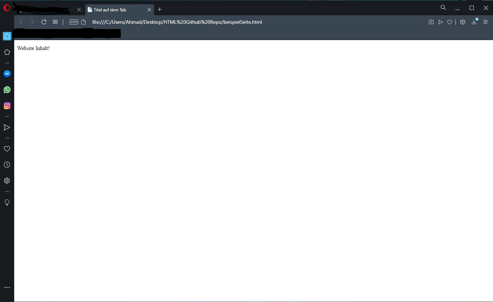

# HTML Kopfzeile

#### Eine HTML Datei wird in 99,9% immer wie folg erstellt

```html
<!DOCTYPE html>
<html>
<head>
<title>Titel auf dem Tab</title>
</head>
<body>
<p>Website Inhalt!</p>
</body>
</html>
```

> Der Tag `<html>` steht für den Anfang des HTML Codes und `</html>` die meisten Tags in HTML werden mit `<>` Geöffnet und mit einem `</>` Geschlossen dies ist im Spätern Teil des Tutorials wichtig da es nicht immer zutrifft.

> Ausßerdem gibt es in HTML sogenannte `<meta>` Tags diese Meta Tags sind für verschiedene Sachen wichtig zum Beispiel um zu defenieren ob die Website UTF-8 benutzen soll oder ähnliches.

```html
<meta charset="UTF-8">
```

> Du kannst auch Keywords setzen damit deine Website mit diesen Keywords z.B. in Google besser gefunden werden kann

```html
<meta name="keywords" content="ahmuudi, CodingSchule, Coding, usw">
```

> Eine Beschreibung kann auch durch ein `<meta>` Tag hinzugefügt werden.

```html
<meta name="description" content="CodingSchule">
```

> Durch einem `<meta>` Tag kannst du auch deine Website automatisch Refreshen

```html
<meta http-equiv="refresh" content="30">
```

> Diese `<meta>` Tags sind auf deiner Seite nicht Sichtbar 

> Deine Website sollte jetzt so aussehen


